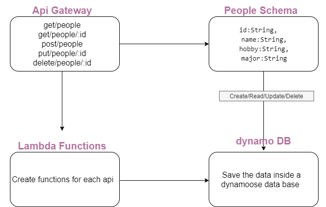

# Lab: Class 18

## serverless-api

### Author: Razan Alamleh

### root URL 
- https://63gnk6uc34.execute-api.us-east-1.amazonaws.com/people

### Routes
- /Get
- /Get/:id
- /Post
- /Put/:id
- /Delete/:id

### Routes Requires
- /Get -------> don't need any requirement
- /Get/:id -------> require id
- /Post -------> don't need any requirement
- /Put/:id -------> require id
- /Delete/:id -------> require id

### Routes Output Return
- /Get -------> getting all the data
- /Get/:id -------> getting specific data depending on the given id
- /Post -------> create new data
- /Put/:id -------> update specific data depending on the given id
- /Delete/:id -------> delete specific data depending on the given id

### UML

### Pull request
[PR](https://github.com/Razan-am/serverless-api-/pull/1)
